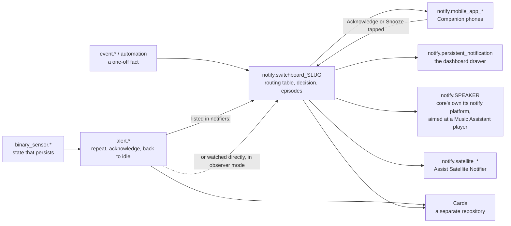
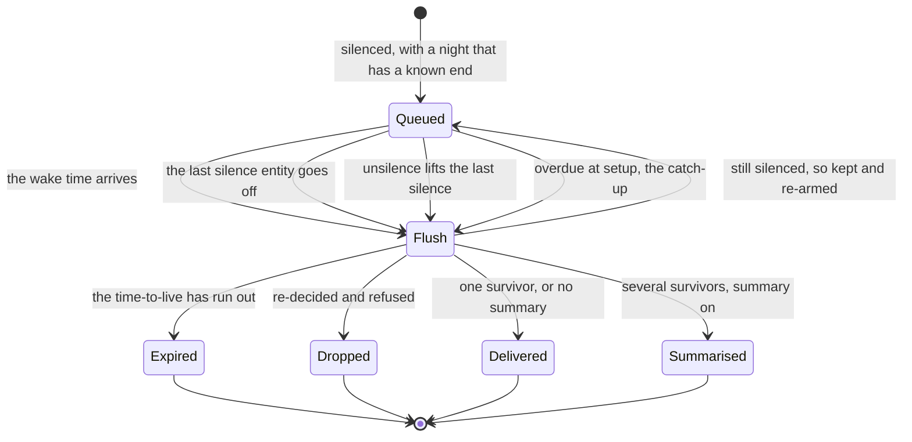
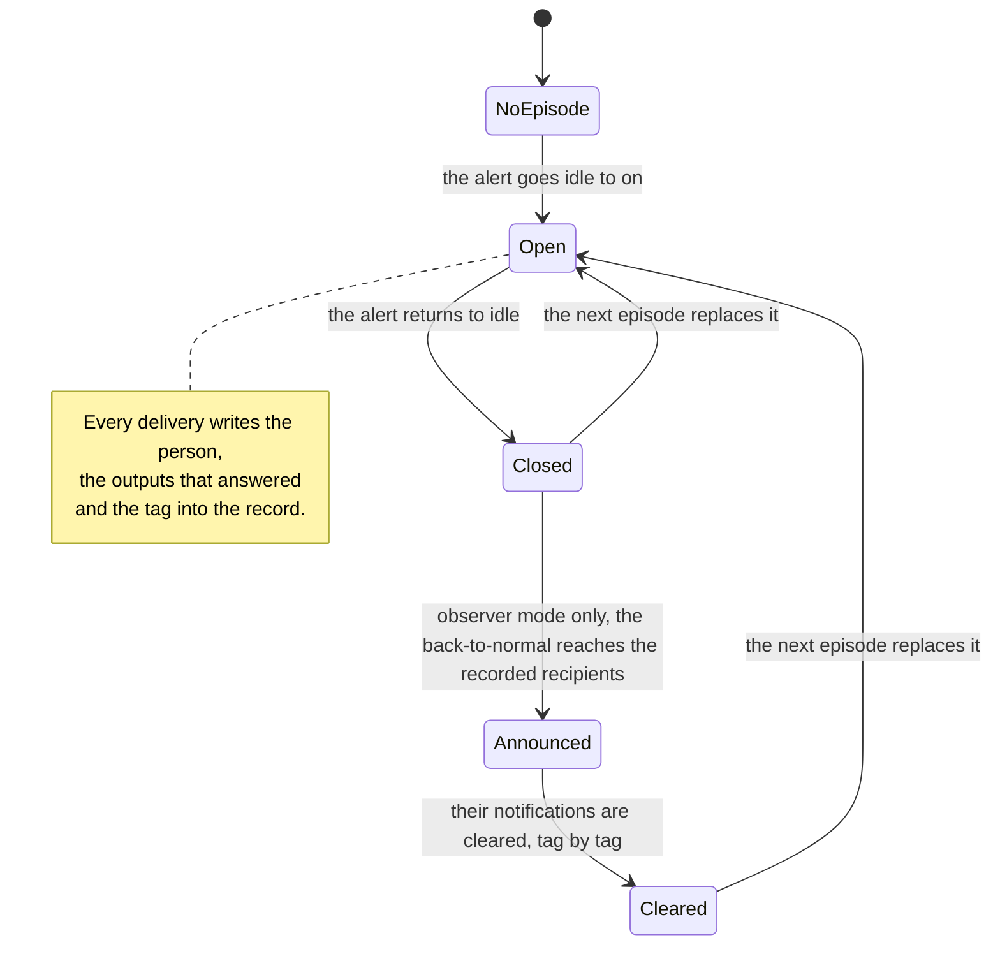

# Architecture

## The proxy model

Notify Switchboard never delivers a notification. It receives a request on
`notify.switchboard[_<slug>]` (or the degraded `NotifyEntity`), decides which
already-existing `notify.*` services should receive it, and calls them — no
channel of its own, no dependency on an external service.

Every box on the right is a `notify.*` service or entity that exists
**before** this integration is installed. A speaker is not a special case:
core's own legacy `platform: tts` notify platform
(`homeassistant/components/tts/notify.py`) makes any `media_player` a
`notify.*` service, and aiming it at a Music Assistant player is what buys
pause and resume. Two sibling adapters that used to sit where that box is,
**Cast Notifier** and **AirPlay Notifier**, were archived on 2026-09-07 for
exactly that reason; **Assist Satellite Notifier** stays, in maintenance
mode, because `assist_satellite` has no `notify` platform of its own.

Cards (a separate repository) read `alert.*` and this integration's own
entities; there is no intermediate "house" sensor.

## Modules

| Module | Role |
|---|---|
| `router.py` | **Pure**: routing table, decision engine, action ids. No `hass`. |
| `dispatcher.py` | Every side effect: service calls, buttons, callbacks, observer mode, deferrals, counters, repairs. |
| `store.py` | `Store`-backed snoozes, night deferrals and temporary silences. |
| `legacy.py`, `notify.py` | `notify.switchboard`/`notify.switchboard_<slug>`, and the degraded `NotifyEntity`. |
| `services.py` | The six `notify_switchboard.*` domain services: schemas and registration only, every decision delegated to `dispatcher.py`. |
| `entity.py`, `sensor.py`, `binary_sensor.py`, `event.py` | Contract §3.5 entities. |
| `config_flow.py`, `validation.py` | The options flow and its pure validation rules: discovers a person's Companion outputs and Focus sensors, bootstraps the managed `default` target, drives the two test steps. Each editor is split into a short step and an advanced one. |

## Input contract

See [`contract.md`](contract.md) (frozen). In short: `message`, `title`,
`target` (a list of routing-table slugs), and `data` carrying `priority`,
`source_entity`, `tag` and anything else, merged over the target's
`default_data`.

## The decision order

`router.decide` runs, per target, in this order, evaluated at **decision
time** from entities that already exist — the router owns no timer or
counter of its own:

1. **The target.** An unknown slug is dropped with `unknown_target` (one
   `repairs` issue).
2. **The effective priority.** The caller's `data.priority` overrides the
   target's default; then, if the target has `escalate_when_nobody_home` and
   no person of its audience is `home`, the priority is raised one step for
   this decision only. A target with no person in its audience escalates
   nothing. From here on "the priority" means the escalated one, everywhere.
3. **The audience, entry by entry.** A `notify` domain entry is a **bare
   output** and skips steps 5–7 entirely; anything else is a person, known or
   not. `notify.notify` and `notify.send_message` can never be an audience
   entry — the options flow and `validation.py` refuse them.
4. **The episode filter**, for a `done` message only (`data.switchboard_done`
   or observer mode's own `on|off → idle` message): reaches only the audience
   entries the target's open episode actually recorded; everyone else is
   dropped with `not_notified`. A target with no `alert_entity` has no
   episodes, so this changes nothing there.
5. **The presence rule**, against the person's `person.*` state. Escalation
   never overrides it: a `home_only` target with nobody home still drops
   everyone with `presence`.
6. **Silence**, unless the priority is `critical`. A configured silence
   entity that is `on` catches the call unless it carries a `min_priority`
   floor the call's priority meets or exceeds. The strictest `on` silence
   decides; an unreadable floor holds everything.
7. **Snooze**, unless the priority is `critical`.
8. **The outputs.** A person's outputs, or the bare output's single one.

An unknown person is dropped with `unknown_person` before step 5; a
configured person the target does *not* name is `not_in_audience` — recorded,
not counted (see [`accepted-deviations.md`](accepted-deviations.md) §3).
Deferral is not part of `decide`: it is what happens to a `silenced` drop, in
the diagram below.

A `critical` message walks past the silence and snooze questions rather than
answering them. Everything from the audience question down runs once per
audience entry; the whole diagram runs once per target named in the call.

## Output contract

For every output of every selected person, and every bare output, the router
calls `notify.<output>` with `message`, `title` and the merged `data`.

An output is resolved in one fixed order: a **registered legacy notify
service** first (every output that works today), then a `notify` **entity
id**, delivered through `notify.send_message` with `message` and `title` and
nothing else — no `data`, no buttons, no tag, no critical payload. The router
resolves an entity itself before calling — missing or `unavailable` counts as
a missing output — because `notify.send_message` logs and skips an
unresolvable entity rather than raising. The `title` is sent to an entity
only when its `supported_features` declares `NotifyEntityFeature.TITLE`, or
publishes none at all ([`accepted-deviations.md`](accepted-deviations.md)
§5).

Where the contract left room:

- **Companion buttons, and every router-added key** (`tag` included), **go
  only to outputs whose service name starts with `mobile_app_`.** Every other
  output gets the caller's `data` merged with the target's `default_data` and
  nothing added — a stray router key is a hard failure on an adapter that
  validates its `data`, not harmless noise (the bug 0.5.1 fixed).
  `authenticationRequired` is written both at the top level of `data`, which
  the acceptance suite pins, and on each action, which the Companion app
  reads. `data.priority` is stripped the same way — see
  [below](#the-critical-payload-per-os).
- **`not_in_audience` is recorded but not counted**; `unknown_person` is a
  real loss and is counted.
- **A partially recursive output list still delivers**: a real output is
  used, and a `recursion` drop is recorded alongside it.
- **A silenced message with a known end is deferred, not dropped, and not
  counted as a drop.** Two conditions: one of the person's own silence
  entities is `on` (a temporary `notify_switchboard.silence` does not count),
  and there is an instant to wake up at — the person's `wake_time`, or the
  end their silence itself publishes (`schedule.*`'s `next_event`; an
  `input_boolean` and a Focus `binary_sensor` publish nothing).
- **A deferral is timezone- and downtime-safe**: the next wake time is built
  from a date rather than by adding 24 hours, so a DST-change night still
  fires at the right local hour, and one whose wake time passed while Home
  Assistant was down is delivered at the next startup instead of waiting
  another day.

### The deferral lifecycle

A deferral is a promise that a message is *late*, not eternal, and not that
the decision that queued it is still true. The queue has four entry points
into a flush; three of them — the wake-time timer and two early flushes (the
last silence entity going `off`, an `unsilence` that lifts the last silence)
— share one config-entry task, and the fourth, catch-up of overdue deferrals
at setup, calls the flush inline.

Inside **Flush**, three steps run in order — time-to-live first, then the
whole routing decision over a fresh context, then the one-or-many question —
so an expired message is never re-decided. Bare outputs never appear here:
they are delivered now or not delivered.

The time-to-live is read at the flush, from the deferral's stored priority,
never frozen at queue time — a household can shorten `info` at 02:00 and it
applies to what is already waiting; `critical` is never deferred, so it never
expires. A flush re-decides and re-logs exactly like a live call, including
any `recursion` drop beside a delivered output; `silenced` is the one outcome
that holds the message, every other drop removes it from the store for good.
The summary is built, not merged — `tag: switchboard-summary`, the union of
the survivors' keys, no caller key, no buttons — and each line counts as one
routed message; it is also recorded into the episodes it summarises, so a
digest carries **one** tag for several targets and the first of those
episodes to close clears the whole digest, running alerts included (the
ADR's reading, not an accident).

Snooze resolves the acting person from `context.user_id` first, matched
against the `person.*` attribute of the same name; failing that, the
Companion `device_id` is looked up and turned into a service name the way
core does it, and when nothing matches, every person in the target's
audience is snoozed. An output that does not exist is tolerated three times
and raises one `repairs` issue on the fourth consecutive miss, cleared by any
successful call; a delivery where every output failed is a drop
(`delivery_failed`), not a routed message.

## UI services

A card, script or automation cannot originate a
`mobile_app_notification_action` event, so everything the Companion buttons
do is also a domain service: `notify_switchboard.acknowledge`, `snooze`,
`unsnooze`, `silence`, `unsilence`, plus the read-only `explain`. They are
registered in `async_setup`, so they exist whether or not a config entry is
loaded (`manifest.json`'s `single_config_entry` makes one entry owning the
domain's services safe); a call made while none is loaded refuses with the
translated `no_loaded_entry`.

Where the contract left room: validation lives in one place, shared by the
Companion event path and the services, so only what each does with a refusal
differs (log-and-return versus a translated `ServiceValidationError`). A
recurring refusal raises a cumulative (not consecutive) `repairs` issue, up
to a bounded number of distinct bad values tracked before they collapse into
one aggregated issue. `silence(minutes:)` is bounded to 1…1440 so it cannot
overflow a `datetime` into a raw crash. The caller's context reaches
`alert.turn_off` as a *child* context, so it cannot trigger an entity
permission check that would put `allow_acknowledge` behind the calling
account's entity policy. The five services are callable by any user, on
purpose — see [`known-issues.md`](known-issues.md).

### Bare outputs

A kitchen speaker, a wall tablet: a thing that can be told something, with no
presence, phone or bedtime. An `audience` entry in the `notify` domain is one
(minus `notify.notify` and `notify.send_message`, refused before storage).
`decide` turns it into its own delivery with `person=None`: no presence rule,
silence, snooze, deferral, wake time or summary, and none of the keys the
router invents — only the caller's `data` merged with the target's
`default_data`, even when the service behind it happens to be a `mobile_app_*`
one. It does not escape the critical payload, which is a property of the
service, not of the audience entry.

It does take part in **episodes**, recorded under the entry as written, so a
`done` message reaches the bare outputs that heard the episode and drops
every other with `not_notified` — but an episode cannot **clear** one, since
the identifiers a clear needs (`tag`, `notification_id`) are withheld from a
bare output on purpose. A bare `notify.persistent_notification` therefore
lingers on the dashboard next to the back-to-normal message; use a
**person's** outputs when you want it cleared.

### The critical payload, per OS

Two changes to what a `mobile_app_*` output receives, and nowhere else — a
summary's `data` is built rather than merged, a critical message is never
deferred, a clear is not a message, and a `NotifyEntity` carries no `data` at
all. The router's own `priority` key is stripped, unconditionally (the only
breaking change of 0.7.0). When the effective priority is `critical` and the
global `critical_payload` option is on (default), the Companion-documented
keys are added: iOS/iPadOS/watchOS get
`push: {sound: {name: default, critical: 1, volume: 1.0}}`; Android gets
`ttl: 0`, `priority: high`, `channel: alarm_stream`; an unmatched
registration gets both. A key the caller already wrote is never overwritten,
and `push` counts as one caller key.

### The two silence sources

`is_person_silenced` is an OR of two independent sources: the person's own
`silence_entities` (owned by the user, read never written, lasting whatever
the entity says) and a `notify_switchboard.silence` (owned by the router,
lasting until its stored expiry). Both produce `silenced` and are bypassed by
`critical`; neither is aware of the other. Night deferral deliberately does
**not** extend to a temporary silence alone — `wake_time` is the end of the
*night*, not of an hour of requested quiet — but a still-running temporary
silence at flush time holds back a message a configured night silence
already deferred, and `unsilence` re-arms on whatever is left.

### Episodes, and closing the loop

An **episode** is one run of a target's `alert_entity`: opens on `idle → on`,
closes on `→ idle`. Episodes exist for every target that names an
`alert_entity`, observer mode or not. While open, each successful delivery
records the person, the outputs that answered, and the effective tag. The
record is closed, not deleted, and reset when the target's next episode
opens — persisted alongside the snoozes, deferrals and temporary silences.

The announce-and-clear half is **observer mode's alone**: a target driven by
its alert's own `notifiers:` keeps an episode and still filters a `done`
message by it, but the router sends and clears nothing for it.

**Every outgoing message carries a name.** `data.tag` defaults to
`switchboard-<slug>` (`-done` for a `done` message, `switchboard-summary` for
a digest); a caller's own always wins. `data.notification_id` mirrors the
effective tag on the bare `persistent_notification` output only. That name
travels no further than the outputs that read it: the default is written on
`mobile_app_*` and `persistent_notification`, and nowhere else. The `done`
message deliberately does not share the episode's own tag, so `clear_done`
(default off) can leave it on the phone while the episode's notifications are
cleared.

When an observer target's episode ends, in order: the `done` message routes
(filtered as above); every `mobile_app_*` output the episode reached gets
`clear_notification` with the episode's tag; `persistent_notification.dismiss`
fires for the matching id; and, if `clear_done` is on, the `done` message is
cleared the same way. **A clear is not a message**: uncounted, no event, no
routing rule, bounded by the same per-output timeout as any call, and a
failure is logged and swallowed.

### Per-target texts

`message`, `done_message` and `default_title` are optional per-target
strings. The two templates render with `alert` bound to the target's
`alert_entity`'s current `State` (or `None`), so a target can write
`{{ alert.attributes.level }}` without a real `AlertEntity` ever gaining
state attributes. A template that raises, or renders empty, is treated as
absent.

| Transition | Order |
|---|---|
| `idle -> on` | alert's `message` attribute → target's `message` template → target's `name` |
| `on\|off -> idle` | target's `done_message` template → alert's `done_message` attribute → translated `common.back_to_normal` |
| title | caller's `title` → target's `default_title` → (observer mode only) target's `name` |

A real `alert.*` exposes no attributes at all, so the target's own templates
are what actually fires there; `default_title` applies per delivery, so a
call fanned out over several targets gets each target's own default.

## Explainability

`notify_switchboard.explain` is a sixth domain service, declared
`SupportsResponse.ONLY`. It answers, per person, what would happen to a
message sent to a target right now: `decision`, the `until` of a deferral,
the `reason` of a drop, a translated `detail` naming the deciding object, and
the outputs it would reach or that are missing. Two top-level keys report the
target as a whole — `escalated` (the rule that raised the priority, `null`
when nothing did) and `priority` (the escalated one) — and a third,
`outputs`, lists the target's bare outputs.

It is a **pure evaluation**: no `notify.*` call, counter, event, queued
deferral or store write. It re-implements the deferral rule as the same
three conditions the dispatcher applies, so it cannot promise a deferral the
dispatcher would not make. The options flow's test steps pair with it: a real
tagged message proves the output works, which `explain` cannot, and then
show the `explain` answer for the same call.

## Zero-config

Three things the instance already knew, surfaced instead of left for the
user to discover: a person's phones (matched by the exact `user_id` a
Companion registration and a `person.*` both publish, never guessed from a
name), their Focus sensors (registered `binary_sensor` entities whose id or
translation key contains `focus`; Android's Do Not Disturb is a multi-state
`sensor` and is deliberately not proposed), and that a fresh install needs a
target at all — the first person added to an empty routing table creates one,
`managed`, audience-of-everybody, until its editor is submitted for good. Two
consistency repairs come with them: `person_without_outputs`, evaluated at
setup, and `alert_entity_missing`, evaluated after a short grace period since
the `alert` component may not exist yet at setup itself.

## The editors, and the words on them

Each editor is split in two so the first form somebody meets is short, and
each half writes only its own fields — changing a phone cannot erase
somebody's night. A target is `slug`, `name`, `alert_entity`, `audience` and
`observer_mode` on the `target` step, the other nine fields on
`target_advanced`; a person is outputs and silence entities on
`person_outputs`, wake time and `summary` on `person_advanced`. Those four
step ids are public names (contract v0.6); `escalate_when_nobody_home` sits
on a third, internal step, `target_escalation` (see
[`accepted-deviations.md`](accepted-deviations.md) §4 for why).

From 0.7.1 every screen, label, error, warning, entity name and action
description is written in plain language, in French, English and Spanish.
Nothing beneath the screens moved — entity ids, service names, option keys
and stored values are unchanged, which is why this document keeps using the
stored vocabulary; the mapping is [`../README.md`](../README.md#glossary)'s.

## Why both a legacy service and an entity

Home Assistant's `alert` integration lists `notifiers:` by legacy `notify.*`
service name; there is no way to point it at a `NotifyEntity`. So the legacy
service is the main entry point — its `targets` property creates one
`notify.switchboard_<slug>` service per target — and the `NotifyEntity` is
the forward-looking, degraded surface. It is registered directly rather than
through `discovery.async_load_platform`, whose discovery route can only be
undone by cancelling the `notify` integration's global dispatcher, after
which the service never comes back on a reload.

## Entities, and persistence

Per person (`
` = the `person.*` object id): `binary_sensor.
_silenced`,
`sensor.
_last_notification`, `sensor.
_active_snoozes`, each on a
virtual device named after the person. Globally:
`sensor.switchboard_routed_today`, `sensor.switchboard_dropped_today`
(attribute `reasons`), `sensor.switchboard_deferred_today` (attribute
`queued`), `sensor.switchboard_routing_table` and `event.switchboard_delivery`
with four frozen event types. Counters reset at local midnight and are
`SensorStateClass.TOTAL` with an explicit `last_reset`, not
`TOTAL_INCREASING` — a daily reset is not a meter rollover.

`sensor.switchboard_routing_table` exists so cards stop copying the table
into their own YAML. Its two attributes, `targets` and `persons`, are
**closed lists** of exactly the keys [`contract.md`](contract.md) names —
never a target's `default_data` (where a secret can end up) or a person's
outputs — and are `_unrecorded_attributes`, since they are configuration, not
history.

One `Store` holds the snoozes (`(person, target) -> expiry`), the night
deferrals, the temporary silences and the episodes, all expired lazily where
relevant. Each migration stamps existing data so an upgrade never invents
history it cannot know; a target that will not parse is dropped rather than
fatal. The recorder database is never touched, and every timer the
switchboard schedules is cancelled both on unload and on
`EVENT_HOMEASSISTANT_STOP`.

## Roadmap

Each increment ships something usable on its own. The router's own release
sequence, independent of the wider suite:

| Release | What it added |
|---|---|
| 0.1.0 – 0.2.0 | The router itself: routing table, per-person decision, acknowledge/snooze, night deferral, observer mode, diagnostics, the five UI services, per-target texts |
| 0.3.0 | Translated entity names with frozen ids, parallel fan-out with a per-output timeout, `person.user_id` as the canonical callback link (ADR-0017) |
| 0.4.0 | Zero-config and explainability: discovered outputs and Focus sensors, a managed `default` target, `notify_switchboard.explain`, consistency repairs (ADR-0018) |
| 0.5.0 – 0.5.1 | Night: time-to-live, one wake-time summary, a full re-decision at flush, early flush, episodes and cleared notifications (ADR-0019) |
| 0.6.0 | Consolidation: a five-field target and two-field person editor with advanced steps, one vocabulary (ADR-0020) |
| 0.7.0 | Escalation, a scheduled priority floor, the routing-table sensor, bare and entity outputs, a critical payload per OS (ADR-0021) |
| 0.7.1 | Plain language: the whole interface rewritten for somebody who does not read code, in three languages — **current release** |
| 0.8 (proposed) | A derived slug, observer mode on by default, a simpler menu, a night `schedule` helper — awaiting the maintainer and an ADR-0022 |
| Later, unscheduled | Escalation after N minutes, a delivery cap, labels on a target, a per-target authentication override, a per-person priority floor, a `places` object, intents — each needing its own ADR |

The voice lines of the wider suite are the part reality overtook: core's own
legacy `platform: tts` notify platform turns any `media_player` into a
`notify.*` service, so the two adapters that duplicated it (Cast, AirPlay)
were archived rather than maintained — see
[`../README.md`](../README.md#adding-a-speaker-as-an-output). Nothing in the
router changed: a speaker was always just another `notify.*` service to it.

## Engineering rules learned

**Legacy `notify` platform lifecycle.** Home Assistant core never retires a
legacy `notify.*` service on its own, and never re-registers one that already
exists. Any integration that registers one (this one, and Assist Satellite
Notifier) must: remove its own service on unload and clear it from
`hass.data[NOTIFY_SERVICES]`; read the live config entry on every call rather
than capturing options at setup; guard shared state with a per-target lock
and cancel timers tied to the entry's lifecycle; validate `data` against a
schema; and expose one device per config entry with a `translation_key`.

## ADR index

| ADR | Title |
|---|---|
| [0001](ADR/0001-native-first.md) | Native first |
| [0002](ADR/0002-pure-proxy.md) | The router is a pure notify proxy |
| [0003](ADR/0003-voice-is-a-separate-adapter.md) | Voice is a separate adapter, never wired to alerts by default |
| [0004](ADR/0004-notifier-hub-rejected-as-base.md) | Notifier Hub rejected as a base |
| [0005](ADR/0005-public-mit-translated.md) | Public repositories, MIT license, English source with fr/es UI |
| [0006](ADR/0006-sprints.md) | Sprints are testable increments, not time boxes |
| [0007](ADR/0007-legacy-notify-service-with-targets.md) | Legacy notify service with per-target `targets`, `NotifyEntity` degraded, observer mode as plan B |
| [0008](ADR/0008-alert-identity-via-target.md) | Alert identity travels through the target, not through `data` |
| [0009](ADR/0009-secure-notification-actions.md) | Secure notification actions — allow-list, authentication, audit |
| [0010](ADR/0010-voice-and-security-are-configuration-rules.md) | "Voice is not an alert" and "no security through voice" are configuration rules, not code guarantees |
| [0011](ADR/0011-frozen-contract-and-contract-test.md) | Frozen input contract and a contract test |
| [0012](ADR/0012-roadmap-reordered.md) | Roadmap reordered — acknowledge, cards and blueprints before voice |
| [0013](ADR/0013-source-unavailability-as-blueprint.md) | Source-unavailability monitoring ships as a blueprint, not in the router |
| [0014](ADR/0014-cast-notifier-name.md) | The Cast voice adapter is named "Cast Notifier" (the repository was archived on 2026-09-07; the ADR is kept as the record of the naming decision) |
| [0015](ADR/0015-refusals-raise-service-validation-error.md) | A refused notification raises `ServiceValidationError`, never fails silently |
| [0016](ADR/0016-ui-services-and-row-texts.md) | UI services (acknowledge/snooze/silence) and per-target message texts |
| [0017](ADR/0017-debts-and-robustness.md) | Debts and robustness — frozen ids under any language, parallel fan-out, canonical callbacks, services without an entry |
| [0018](ADR/0018-zero-config-and-explainability.md) | Zero-config and explainability — `explain`, discovered Companion outputs, a managed default target, consistency repairs |
| [0019](ADR/0019-night-catch-up-and-closing-the-loop.md) | Night, catch-up and closing the loop — TTL, one wake-time summary, a full re-decision at flush, early flush, episode recipients, cleared notifications |
| [0020](ADR/0020-consolidation.md) | Consolidation — a five-field target, an optional wake time, one vocabulary, and documents that tell the truth |
| [0021](ADR/0021-escalation-and-places-reduced.md) | Escalation and places, reduced — one step when nobody is home, a scheduled priority floor, the routing table as an entity, acknowledgement authorship, bare and entity outputs, a critical payload per OS |
