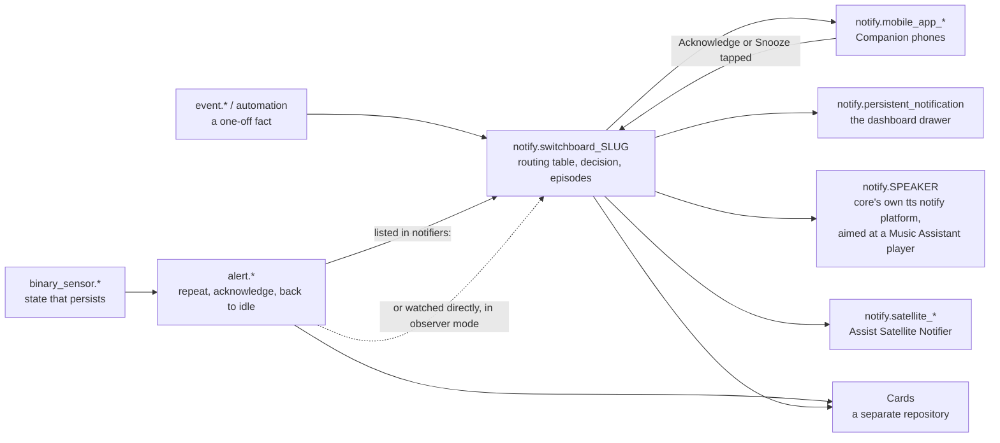
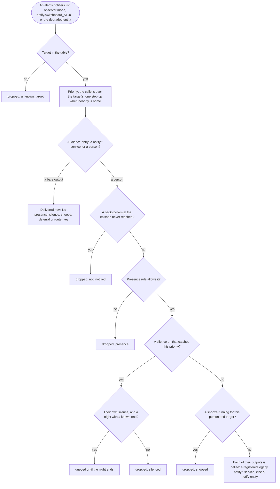
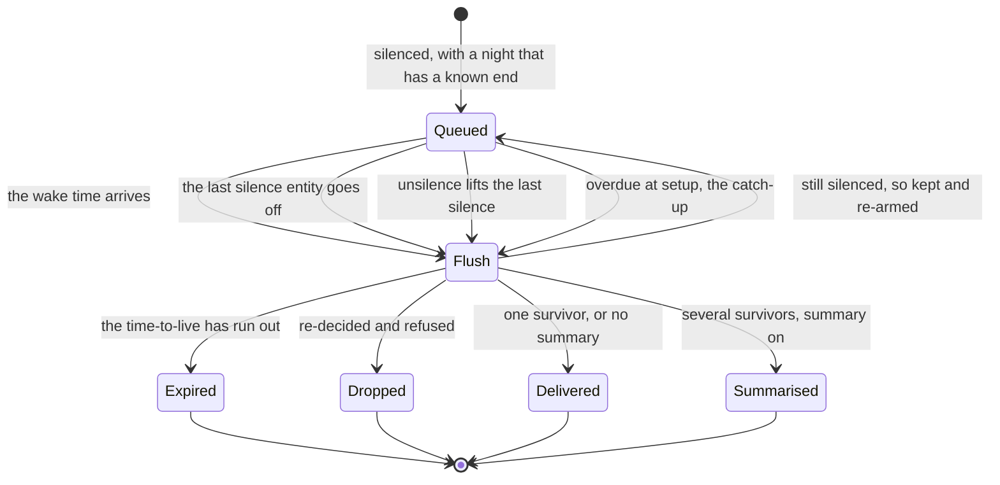
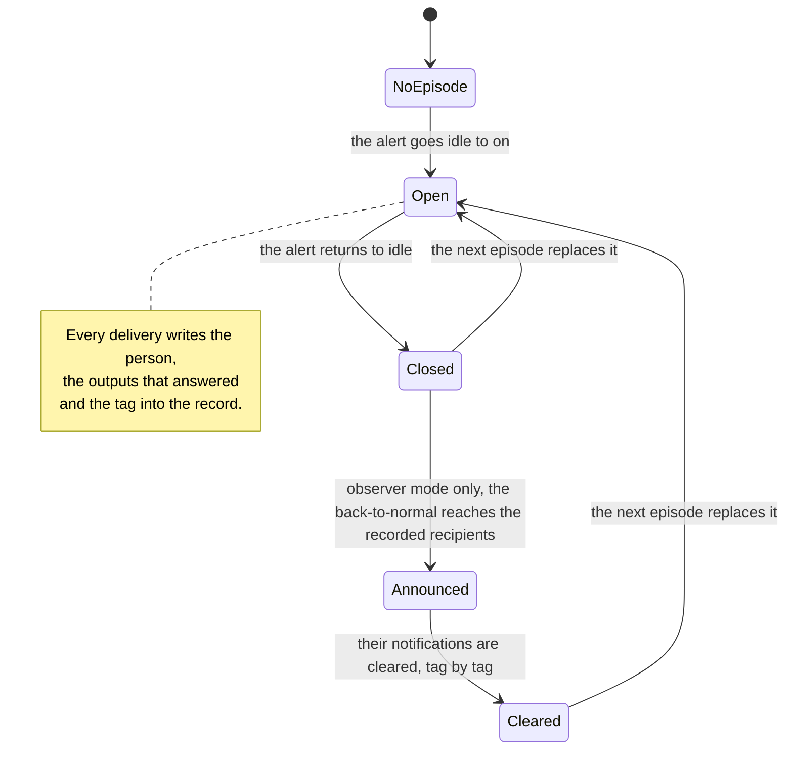

# Architecture

## The proxy model

Notify Switchboard never delivers a notification. It receives a request on
`notify.switchboard[_<slug>]` (or the `NotifyEntity`), decides which
already-existing `notify.*` services should receive it, and calls them. It
creates no channel of its own and no dependency on an external service.

*What the map does not show:* the decision itself (the next diagram does that),
the six `notify_switchboard.*` domain services a card calls, and the stored
snoozes and temporary silences. Every box on the right is a `notify.*` service
or entity that exists **before** this integration is installed: the switchboard
creates no channel of its own. A speaker is not a special case — core's own
legacy `platform: tts` notify platform
(`homeassistant/components/tts/notify.py`) makes any `media_player` a
`notify.*` service, and aiming it at a Music Assistant player is what buys
pause and resume. Two sibling adapters that used to sit where that box is,
**Cast Notifier** and **AirPlay Notifier**, were archived on 2026-09-07 for
exactly that reason; **Assist Satellite Notifier** stays, in maintenance mode,
because `assist_satellite` has no `notify` platform of its own.

Cards (a separate repository) read `alert.*` and this integration's own
entities. There is no intermediate "house" sensor.

## Modules

| Module | Role |
|---|---|
| `router.py` | **Pure**: routing table, decision engine, action ids. No `hass`. |
| `dispatcher.py` | Every side effect: service calls, buttons, callbacks, observer mode, deferrals, counters, repairs. |
| `store.py` | `Store`-backed snoozes, night deferrals and temporary silences. |
| `legacy.py` | `notify.switchboard` and `notify.switchboard_<slug>`. |
| `services.py` | The six `notify_switchboard.*` domain services — the five acting ones (v0.2, ADR-0016) and the read-only `explain` (v0.4, ADR-0018): schemas and registration only, every decision delegated to `dispatcher.py`. |
| `notify.py` | The degraded `NotifyEntity`. |
| `entity.py`, `sensor.py`, `binary_sensor.py`, `event.py` | Contract §3.5 entities. |
| `config_flow.py`, `validation.py` | Options flow and its pure validation rules. It discovers a person's Companion outputs and Focus sensors out of the `mobile_app` config entries, bootstraps the managed `default` target, and drives the two test steps (v0.4). Since v0.6 the two editors are split in two steps each — `target` / `target_advanced` and `person_outputs` / `person_advanced` — and v0.7 adds a third target step, `target_escalation`. |

The pure/impure split is what makes the decision engine unit-testable at 100 %
branch coverage without a `HomeAssistant` instance.

## Input contract

See `docs/contract.md` (frozen). In short: `message`, `title`, `target` (a list
of routing-table slugs), and `data` carrying `priority`, `source_entity`, `tag`
and anything else, which is merged over the target's `default_data` and forwarded
unchanged.

## The decision order (v0.7, ADR-0021)

`router.decide` runs, per target, in this order. Everything in it is evaluated
at **decision time**, from entities that already exist: the router owns no
timer and no counter of its own for any of it.

1. **The target.** A slug the routing table does not know is dropped with
   `unknown_target`, and a `repairs` issue is raised once.
2. **The effective priority.** `data.priority` overrides the target's
   `default_priority` as it always has; then, when the target carries
   `escalate_when_nobody_home` and **no** person of its audience is in the
   literal state `home`, the priority is raised **one step** —
   `info→normal→high→critical`, `critical` unchanged — for this decision only.
   A target with no person in its audience escalates nothing: an audience of
   bare outputs is not an empty house. From here on, "the priority" means the
   escalated one, everywhere: the silence and snooze bypass,
   `authenticationRequired`, the `routed` event and the critical payload.
3. **The audience, entry by entry, split by domain.** An entry in the `notify`
   domain is a **bare output** and skips steps 5 to 7 entirely; anything else
   is a person, known or not. Two `notify` services can never be an audience
   entry — `notify.notify`, the undifferentiated fan-out this router exists to
   replace, and `notify.send_message`, the entity action, whose schema requires
   an `entity_id`. The options flow hides both from the picker and
   `validation.py` refuses either typed by hand, so neither ever reaches
   `decide`. `notify.persistent_notification` is deliberately allowed.
4. **The episode filter**, for a `done` message only, and before anything
   below it. A call carrying `data.switchboard_done` — or observer mode's own
   `on|off → idle` message — reaches only the audience entries that target's
   open episode actually recorded; every other entry is dropped with
   `not_notified`. A target with no `alert_entity` has no episodes, so the key
   changes nothing there.
5. **The presence rule** of the target, against the person's `person.*` state.
   The escalation never overrides it: a `home_only` target with nobody home
   drops every person with `presence`, escalated or not.
6. **Silence**, unless the priority is `critical`. A configured silence entity
   that is `on` catches this call when it carries no `min_priority` state
   attribute, or when the call's priority is **below** the floor that
   attribute names. The strictest `on` silence decides, and an unreadable
   floor is ignored, so the entity silences everything: a floor fails towards
   quiet. A temporary `notify_switchboard.silence` carries no floor.
7. **Snooze**, unless the priority is `critical`.
8. **The outputs.** A person's, or the bare output's single one.

A person the persons table does not know is dropped with `unknown_person`
before step 5, and every configured person a target does *not* name is
recorded as `not_in_audience` at the end — recorded, not counted (see
[`accepted-deviations.md`](accepted-deviations.md) §3).

Deferral is not part of `decide`: it is what `dispatcher.Switchboard._async_defer`
does with a `silenced` drop, and the next diagram places it where it happens.

*What the path does not show:* a `critical` message walks past the two silence
and snooze questions rather than answering them; the `unknown_person` and
`not_in_audience` branches; the `recursion` refusal an output pointing back at
`notify.switchboard*` earns, which can sit *beside* a delivery when a person
has one good output and one bad; and everything that happens to a queued
message, which is the deferral diagram further down. Everything from the
audience question downwards runs **once per audience entry**, and the whole
diagram runs once per target named in the call.

## Output contract

For every output of every selected person — and for every bare output of the
audience — the router calls `notify.<output>` with `message`, `title` and the
merged `data`.

An output is resolved in one fixed order (ADR-0021 §6): a **registered legacy
notify service** first, which is what every output that works today is, then a
`notify` **entity id**, delivered through `notify.send_message` with `message`
and `title` and nothing else — no `data`, so no target `default_data`, no
caller key, no tag, no buttons and no critical payload. A legacy service and an
entity share one namespace, so the order is stated rather than discovered. The
router resolves the entity itself before calling — absent from the state
machine, or `unavailable`, is a missing output — because `notify.send_message`
is an entity service and core logs and skips an entity it cannot resolve rather
than raising, so calling and hoping would count a delivery that never happened.
The `title` is sent only to an entity whose published `supported_features`
declares `NotifyEntityFeature.TITLE`, or that publishes none at all; that is
one step further than ADR-0021 §6 asks, and why is in
[`accepted-deviations.md`](accepted-deviations.md) §5.

Where the contract left room, the router settled it like this:

- **Companion buttons are added only to outputs whose service name starts with
  `mobile_app_`.** Other outputs get the merged `data` without `actions` and
  without `authenticationRequired`. Since 0.5.1 the same holds for every key
  the router adds, `tag` included (ADR-0019 §6, amendment 2026-09-07 (2)):
  what an output receives is the caller's `data` merged with the target's
  `default_data`, plus only the keys that output reads.
- **`data.priority` is removed from what a `mobile_app_*` output receives**,
  unconditionally, since 0.7.0. It is a router input, not a Companion key. See
  "The critical payload, per OS" below; every other kind of output still
  receives it untouched.
- **`authenticationRequired` is written both at the top level of `data` and on
  each action.** The acceptance suite pins the top-level key; the per-action
  key is what the Companion app actually reads.
- **`not_in_audience` is recorded but not counted.** The decision lists every
  configured person a target does not name, so diagnostics can show why somebody
  was quiet, but `sensor.switchboard_dropped_today` ignores that reason: the
  contract says such a person is "not considered", and counting them would
  make the daily figure meaningless in a house with several people.
- **`unknown_person` is counted.** A target whose `audience` names somebody the
  persons table does not know about (a hand-edited `.storage`, a person
  deleted after the target was written) is a real loss: the target asked for that
  person to be notified and nobody was. It is a separate reason from
  `not_in_audience` and it counts towards `sensor.switchboard_dropped_today`.
- **A partially recursive output list still delivers.** If a person has one
  `switchboard_*` output and one real one, the real one is used and a
  `recursion` drop is recorded alongside.
- **A silenced message whose night has a known end is deferred, not dropped**,
  and is therefore not counted as a drop. Two conditions, both in
  `_async_defer`: one of the person's **own** silence entities is `on` (a
  temporary `notify_switchboard.silence` is an hour of requested quiet, not a
  night), and there is an instant to wake up at — the person's `wake_time`,
  or, since 0.6.0 (ADR-0020 §3), the end their silence publishes when they have
  none. Exactly one core domain publishes such an end today: a `schedule`
  entity's `next_event` attribute. An `input_boolean` and a Focus
  `binary_sensor` publish nothing, so a person with neither a wake time nor a
  schedule is dropped with `silenced`, as in 0.1 → 0.5. Deferrals are
  de-duplicated on `(person, target, tag)`; since 0.5.0 the `tag` half is
  always populated (the target's default `switchboard-<slug>` when the caller
  supplies none), so an untagged message still de-duplicates on
  `(person, target)` in practice.
- **The next wake time is built from a date, never by adding 24 hours** to an
  aware datetime, so a message queued the night of a DST change fires at the
  right local hour (`dispatcher.next_wake_time`).
- **A deferral whose wake time passed while Home Assistant was down is
  delivered at the next setup.** Each `DeferredMessage` carries `queued_at`;
  at startup `Switchboard._async_catch_up_deferrals` compares
  `next_wake_time(queued_at, wake_time)` with `dt_util.now()` and flushes what
  is already late, instead of rescheduling it for the following day. The
  `(person, target, tag)` key still de-duplicates, so nothing is sent twice.

### The deferral lifecycle (v0.5, ADR-0019; v0.6, ADR-0020 §3)

A deferral is a promise that a message is *late*, not that it is eternal, and
not that the decision that queued it is still true. From 0.5.0 the queue has
**four** entry points into a flush, and a message leaves it expired, dropped,
delivered or folded into a summary — or does not leave it at all.
Three of them -- the wake-time timer and the two early flushes of §4, the last
configured silence going `off` and a `notify_switchboard.unsilence` that lifts
the last silence there was -- reach it through `_async_schedule_flush` and
therefore share one config-entry task; the fourth, the catch-up of overdue
deferrals at setup, calls the flush inline.

*What the lifecycle does not show:* the three steps inside **Flush** run in
that order — the time-to-live first, then the whole routing decision over a
fresh context, then the one-or-many question — so a message that has expired is
never re-decided. Nor does it show that queueing bumps
`sensor.switchboard_deferred_today` while every arrow that *leaves* **Flush**
is counted, as a routed message or as a drop with its own reason; that a
`recursion` refusal can be counted beside a survivor that goes out anyway;
that a summary is built rather than merged, and each of its lines counts as
one routed message;
or that the two middle arrows into **Flush** are ADR-0019 §4's early flushes,
and that the three scheduled entry points share one config-entry task while the
catch-up runs inline. Bare outputs never appear here at all: they are delivered
now or not delivered.

- **The scheduled entry points go through one task.** `_async_schedule_flush` hands the
  flush to a task of the config entry's own, so it never runs inside the timer
  sweep or the state write that triggered it. Unloading the entry **waits** for
  that task rather than cancelling it — `_async_process_on_unload`
  (`homeassistant/config_entries.py`) cancels only `_background_tasks` and
  gives `_tasks` ten seconds — which is what a flush wants, since it pops
  deferrals from the store before delivering and saves once at the end. A
  flush that has not begun by then stands down on the `_shutdown` flag
  `async_shutdown` sets, and nothing re-arms a deferral timer past that point.
- **The time-to-live is read at the flush**, from the deferral's stored
  priority and stored `data` (`router.resolve_ttl`), never frozen at queue
  time: `entry.options["ttl_minutes"]` is a household policy, so shortening
  `info` at 02:00 means it for what is already waiting. `critical` is never
  deferred, so it can never expire.
- **A flush writes to `decision_log` like an inbound call.** A deferred
  message is decided twice — once when it is queued, once when it is flushed —
  and only the first used to reach the diagnostics, so `last_decisions` went
  quiet over exactly the window it exists to explain. Each re-decided message
  gets its own entry now, in `_async_apply`'s shape plus `flush: true`; a
  message still held by the silence appears there too. And `_redecide` carries
  back the refusals that come *beside* a delivery — `router.route_person`
  returns a `recursion` drop alongside the usable outputs — so a loop
  configured into the table is counted at the flush exactly as it is live,
  instead of being lost when the first routed item returns.
- **`silenced` is the one re-decision outcome that holds a message.** The
  night is not over, which is the whole point of a deferral; the flush is
  re-armed for whichever comes first, the end of a temporary silence or the
  next wake time. Every other drop is real, carries the reason that says why,
  and removes the message from the store.
- **The summary is built, not merged**: `tag: switchboard-summary`, the union
  of the `switchboard_*` keys of the collapsed survivors, and nothing else —
  no caller key, no target `default_data`, and no Companion buttons, which on a
  digest of three alerts could only act on an arbitrary one of them. Each
  **line** counts as one routed message and fires one `routed` event, so the
  daily figures still add up to what was queued.
- **A digest is a delivery, so it is recorded into the episodes it
  summarises** (ADR-0019 §6, amendment (b)): each kept line writes the person,
  the outputs that answered and the tag `switchboard-summary` into its target's
  open episode. Without it the person a digest woke would be filtered out of
  the `done` message by the `not_notified` rule, and the digest would stay on
  their phone after the alert ended.

  The side effect is literal and deliberate: a digest carries **one** tag for
  the several targets it collapses, so the first of those episodes to close
  clears `switchboard-summary` and the whole digest goes with it — including
  its lines about alerts that are still running. The alternative — one tag per
  line — would need one notification per line, which is exactly what the
  summary exists to avoid. The reading is the ADR's, not an accident: §5
  records "the tag actually delivered", and a digest delivered exactly one.
- **Snooze resolves the acting person from `context.user_id` first.** The
  Companion webhook re-fires the action event with the registration's own
  context (`homeassistant/components/mobile_app/webhook.py`,
  `webhook_fire_event` → `registration_context(config_entry.data)` →
  `Context(user_id=…)`), and a `person.*` entity publishes the user it is
  linked to as a `user_id` attribute
  (`homeassistant/components/person/const.py`,
  `PersonEntityStateAttribute.USER_ID`). If a person in the target's audience
  matches, only that person is snoozed.
  Failing that, the Companion `device_id` is looked up directly and as a
  `("mobile_app", <id>)` identifier; the device's name, its user-given name and
  its config entry's `device_name` are turned into a service name exactly the
  way core does it — `slugify(f"mobile_app_{name}")`,
  `homeassistant/components/notify/legacy.py` — and matched against the
  persons' outputs. When nothing matches — the documented ambiguous case —
  every person in the target's audience is snoozed.
- **Outputs are stored without their `notify.` prefix.** `parse_person`
  normalises `notify.mobile_app_x` to `mobile_app_x`, so the two spellings a
  user may reasonably write behave identically for person resolution, for
  Companion-button gating and for the recursion check.
- **An output that does not exist is tolerated three times** (load order) and
  raises one `repairs` issue on the fourth consecutive miss. An output that
  *does* exist but raises on every call feeds the same counter and the same
  issue: from the user's point of view it is just as unusable. Any successful
  call clears the counter (`Switchboard.failing_outputs`).
- **A delivery where every output failed is a drop, not a routed message.**
  `sensor.switchboard_routed_today` counts notifications that actually went
  out; when no output of a person accepted the call, the reason
  `delivery_failed` is counted on `sensor.switchboard_dropped_today` instead.
  One working output out of several is still a delivery.

## UI services (v0.2, ADR-0016)

A card, a script or an automation cannot originate a
`mobile_app_notification_action` event, so everything the Companion buttons do
is also a domain service: `notify_switchboard.acknowledge`, `snooze`,
`unsnooze`, `silence`, `unsilence`. Since v0.3 (ADR-0017 §5) they are
registered in `async_setup` and therefore exist whether or not a config entry
is loaded; a call made while none is refuses with the translated
`no_loaded_entry`. `manifest.json`'s `single_config_entry` is what makes one
entry owning the domain's services safe. The read-only `explain` of v0.4 joins
them under exactly the same rules (see "Explainability" below).

Where the contract left the UI services room, they settled it like this:

- **Validation lives in one place.** `Switchboard.acknowledge_is_allowed`,
  `_require_target`, `_require_person`, `_require_persons` and
  `_async_store_snooze` are shared by the Companion path and the services; the
  only difference is what each does with a refusal. The event handler logs and
  returns (nobody is listening); the service raises `ServiceValidationError`
  with a `translation_key` resolved from the `exceptions` section of
  `strings.json`.
- **The voluptuous schemas are strict about shape, permissive about value.**
  `homeassistant/core.py`, `ServiceRegistry.async_call`, re-raises a schema's
  `vol.Invalid` as-is, and a `vol.Invalid` is not a `ServiceValidationError`.
  So `minutes: 0`, a duration the target does not offer, an unknown slug and an
  unknown person are all checked in the handler, never in the schema.
- **A recurring refusal raises a `repairs` issue, and fixing the cause clears
  it.** One bad call is answered to its caller; the same unknown target or
  person refused `MAX_INVALID_SERVICE_CALLS` times is a card nobody fixed, and
  gets an issue — the same posture as `MAX_CONSECUTIVE_OUTPUT_MISSES`, with two
  differences that matter. The count is **cumulative, not consecutive**: three
  refusals a week apart raise the issue just as three in a row do, because a
  card wired to a stale slug fires whenever somebody taps it. And an issue
  outlives the refusals that raised it, so it is deleted explicitly — when the
  same slug or person is accepted again, and at setup for every slug and person
  the (reloaded) table now knows about, which is what an options-flow fix
  amounts to.
- **Only `MAX_TRACKED_INVALID_SERVICE_CALLS` distinct bad values are tracked.**
  A caller producing a fresh invalid value on every call — a template rendering
  to garbage — would otherwise grow the counter dict and the *persisted* issue
  registry without bound. Past the cap, no new per-value issue is raised and a
  single aggregated `invalid_service_calls_many` stands for the rest.
- **Bounded arithmetic on `silence(minutes:)`.** `MIN_SILENCE_MINUTES ≤ minutes
  ≤ MAX_SILENCE_MINUTES` (1 … 1440) is enforced in the handler. The lower bound
  is ADR-0016's rule; the upper one exists because
  `dt_util.utcnow() + timedelta(minutes=...)` raises `OverflowError` — a plain
  `Exception`, not a `HomeAssistantError` — once the result leaves `datetime`'s
  range, which would reach the caller as a crash rather than as the translated
  refusal ADR-0015 promises.
- **The caller's context is carried, but not into the authorisation.**
  `alert.turn_off` gets a **child** of the caller's `Context`, not the caller's
  own: a non-empty `context.user_id` on an entity service call makes
  `homeassistant/helpers/service.py` run an auth lookup and a per-entity
  permission check, which would put the target's `allow_acknowledge` allow-list
  behind whatever entity policy the calling account has. The logbook resolves
  the parent context for attribution
  (`homeassistant/components/logbook/processor.py`). The
  `event.switchboard_delivery` entity, whose state write runs no permission
  check, gets the caller's context directly.
- **The five services are callable by any user, on purpose.** The wall tablet
  runs under a non-admin account and its cards are the main caller; the
  allow-list, not the caller's role, is what bounds them. See the addendum to
  ADR-0016 and `docs/known-issues.md`.

### Bare outputs: an audience entry that is not a person (v0.7, ADR-0021 §5)

A kitchen speaker, a wall tablet's toast overlay: a thing that can be told
something, with no presence, no phone and no bedtime. An `audience` entry in
the `notify` domain is one, and the domain is the whole rule — with two
exceptions the options flow refuses before anything is stored,
`notify.notify` and `notify.send_message` (`router.is_component_service_output`
says why each one cannot be a recipient).

`decide` turns such an entry into its own `RoutedDelivery` with `person=None`
and exactly one output. It has no presence rule, no silence, no snooze, no
deferral, no time-to-live, no wake time and no summary; it receives exactly the
caller's `data` merged with the target's `default_data`, and none of the keys
the router invents — no `actions`, no `authenticationRequired`, no
`notification_id`, no default `tag`, even when the service behind it happens to
be a `mobile_app_*` one. What it does **not** escape is the critical payload
below: that is a property of the service, not of the audience entry.

It does take part in **episodes**: the delivery is recorded under the audience
entry as written, so a `done` message reaches the bare outputs that heard the
episode's messages and every other one is dropped with `not_notified`, exactly
like a person. A delivered bare output is one routed delivery, reported in a
`routed` event whose `person` key is `null`; a missing one is
`delivery_failed`; one resolving to `notify.switchboard*` is refused with
`recursion`. No drop reason and no event type is added for any of it.

What an episode cannot do for a bare output is **clear** it. The clear at the
end of an observer episode is addressed by the identifiers the router adds --
`data.tag` for a `clear_notification` push, `data.notification_id` for
`persistent_notification.dismiss` -- and `_scope_output_data` withholds both
from a bare output precisely because they are router keys. A bare
`notify.persistent_notification` is therefore recorded in `episode.outputs`
(as `persistent_notification`, the normalised name) and the dismiss does fire,
with a `notification_id` that never labelled anything: core created the
notification under an id of its own, and it lingers on the dashboard next to
the back-to-normal message. Accepted, not worked around: giving a bare output
`notification_id` would put a router key back into the payload that the whole
of §5 exists to keep clean. `persistent_notification` in a **person's**
outputs is the shape that gets cleared.

This is the reduced form of "places" and the whole of it. The object that would
have modelled a room is deferred (ADR-0021 §9).

### The critical payload, per OS (v0.7, ADR-0021 §7)

Two changes to what a `mobile_app_*` output receives, and to nothing else.

- The router's own `priority` key is **stripped, unconditionally**. It is a
  router input, not a Companion key, and Android's Companion app reads
  `data.priority` and knows one value, `high`. This is the only breaking
  change of 0.7.0.
- When the effective priority is `critical` and the global `critical_payload`
  option is on (default), the keys the Companion documentation gives are
  added: on iOS / iPadOS / watchOS `push: {sound: {name: default, critical: 1,
  volume: 1.0}}`, on Android `ttl: 0`, `priority: high`,
  `channel: alarm_stream`. The OS comes from the matching `mobile_app`
  registration's `os_name`, matched case-insensitively; anything the router
  cannot identify gets **both** sets. A key the caller or the target's
  `default_data` already wrote is never overwritten, and `push` counts as a
  single caller key.

It applies nowhere else: a wake-time summary's `data` is *built* rather than
merged and a critical message is never deferred, a `clear_notification` is not
a message, and a `NotifyEntity` output carries no `data` at all.

### The two silence sources

`is_person_silenced` is an **OR** of two independent sources:

| Source | Owned by | Lifetime |
|---|---|---|
| the person's `silence_entities` (`schedule.*`, `input_boolean.*`, …) | the user — read, never written | whatever the entity says |
| a `notify_switchboard.silence` | the router | until its stored expiry |

Both produce the same `silenced` drop reason, both are bypassed by
`priority: critical`, and neither is aware of the other. Temporary silences
live in the same `Store` as snoozes (`person -> until`) and expire twice over:
lazily, in `build_context`, the way snoozes already do; and on an
`async_track_point_in_time` timer per person, so
`binary_sensor.<person>_silenced` returns to `off` at the minute the silence
lifts rather than at the next notification. That entity gains an `until`
attribute while a temporary silence runs; `sources` keeps the meaning it has
had since 0.1.0 (the configured entities only).

Night deferral is deliberately **not** extended to temporary silence: a
message silenced only by a `notify_switchboard.silence` is dropped, because
`wake_time` is the end of the *night*, not the end of an hour of requested
quiet. When a configured night silence is also active, the message is deferred
as before — nothing is lost. A temporary silence still running when that
deferral comes due holds it back (both sources are read at flush time), and the
flush is then re-armed for the end of the silence. `notify_switchboard.unsilence`
moves that end: it flushes on the spot when nothing else is holding the queue,
and otherwise re-arms on what is left, so a queue is never waiting on an expiry
that has been cancelled.

### Episodes, and closing the loop (v0.5, ADR-0019 §5 and §6)

An **episode** is one run of a target's `alert_entity`: it opens on that entity's
`idle → on` transition and closes on its `→ idle` one. Episodes exist for
every target that names an `alert_entity`, in observer mode or not, so the router
subscribes to *every target's* alert rather than only to the observed ones.

While an episode is open, each successful delivery records the person, the
`notify.*` outputs that answered and the message's effective `data.tag`. The
record is closed — not deleted — when the alert returns to `idle`, and reset
when that target's **next** episode opens: a `done` message is by definition sent
after the alert is already back to `idle`, so the recipients have to outlive
the episode's end. Everything is persisted with the snoozes, the deferrals and
the temporary silences (store minor version 4).

A `done` message — observer mode's `on|off → idle` message, or any call
carrying `data.switchboard_done: true` — reaches only the audience entries in
that set; everybody else in the audience is dropped with `not_notified`, before
the rest of the decision runs. A target with no `alert_entity` has no episodes
at all, so that key routes to the whole audience there, exactly like any other
message.

*What the episode lifecycle does not show:* the `on → off` transition, which is
an acknowledgement and changes nothing here — the alert is still firing. Nor
does it show that the announce-and-clear half is **observer mode's alone**: a
target driven by its alert's own `notifiers:` list keeps an episode, and its
recipients still filter a `done` message, but the router sends nothing and
clears nothing for it. Also absent: `clear_done`, which extends the clear to
the back-to-normal message itself; the bare outputs recorded in the same
record, which are told it is over but can never be cleared; and the store
write behind each transition.

**Every outgoing message carries a name.** `data.tag` defaults to
`switchboard-<slug>`, `switchboard-<slug>-done` for a `done` message and
`switchboard-summary` for a digest; a caller's own always wins.
`data.notification_id` mirrors the effective tag and is added for the bare
`persistent_notification` output only — the one core documents as reading it
(`homeassistant/components/notify/__init__.py`, the `persistent_notification`
service handler).

That name is the router's own key, so it travels no further than the outputs
that read it: the **default** `tag` is written on `mobile_app_*` outputs and on
`persistent_notification` (where it is the source of the id), and nowhere else.
Every other output gets the caller's `data` merged with the target's
`default_data` and nothing added — the router is a proxy, and an adapter that
validates its `data` refuses an unknown key by design, so a stray router key is
a `ServiceValidationError` on every call rather than harmless noise. That is
not hypothetical: it is the bug 0.5.1 fixed, and Assist Satellite Notifier's
`ALLOWED_DATA_KEYS` is the surviving example (AirPlay Notifier's
`PREVENT_EXTRA` schema was the other, before that repository was archived).
The effective tag is still computed for
every message: the episode record, the de-duplication key and the closing
sequence all read it. The `done` message deliberately does **not** share the
episode's tag: `clear_done` defaults to off, and a message carrying
`switchboard-<slug>` could not be kept on the phone while the episode's own
notifications are cleared.

When an **observer** target's episode ends, in this order: the `done` message is
routed (filtered as above); every `mobile_app_*` output the episode reached is
called with `message: clear_notification` and the episode's tag
(`homeassistant/components/mobile_app/const.py`, `CLEAR_NOTIFICATION` — core
forwards the payload to the push relay and the Companion app is what removes
the notification); `persistent_notification.dismiss` is called for the
matching id when that output was reached; and, if the target carries
`clear_done: true`, the `done` message is cleared the same way on the outputs
that received it.

**A clear is not a message.** It is not counted, it fires no
`event.switchboard_delivery`, it is subject to no presence, silence, snooze or
deferral rule, and it never creates a deferral of its own. It is bounded by
the same `OUTPUT_TIMEOUT_SECONDS` as any other output call and a failure is
logged and swallowed. Observer mode is the only narrowing (ADR-0019 §6,
amendment (a)): the clear does not ask what backs the `alert.*` state, so a
state written into the `alert` domain by a template, a script or a test is
tidied up after exactly like one the `alert` integration owns — the router
observed it and notified on the strength of it either way.

### Per-target texts and the template context

`message`, `done_message` and `default_title` are optional per-target strings,
absent by default. The two templates are rendered with
`Template(raw, hass).async_render({"alert": <State|None>}, parse_result=False)`
(`homeassistant/helpers/template/__init__.py`): `alert` is the target's
`alert_entity`'s current `State`, or `None` when the target has no alert or the
entity does not exist, so a target can write `{{ alert.attributes.level }}`
without waiting for a real `AlertEntity` to gain state attributes. A template
that raises is logged and treated as absent; so is one that renders to an
empty string. `parse_result=False` keeps a message a string rather than
letting a numeric-looking render become an `int`.

Resolution order, unchanged when the new fields are absent:

| Transition | Order |
|---|---|
| `idle -> on` | alert's `message` attribute → target's `message` template → target's `name` |
| `on\|off -> idle` | target's `done_message` template → alert's `done_message` attribute → translated `common.back_to_normal` |
| title | caller's `title` → target's `default_title` → (observer mode only) target's `name` |

The two orders differ because the contract and ADR-0016 order them
differently; on a real `alert.*`, which exposes no attributes at all, both
chains behave identically. `default_title` is applied per delivery, in
`_async_deliver`, not per request, so a call fanned out over several targets gets
each target's own default.

## Explainability (v0.4, ADR-0018)

`notify_switchboard.explain` is a sixth domain service, registered next to the
five acting ones and declared `SupportsResponse.ONLY`. It answers, per person,
what would happen to a message sent to a target right now: `decision` (`routed` /
`deferred` / `dropped`), the `until` of a deferral, the `reason` of a drop, a
translated `detail` naming the deciding object, and the `notify.*` services the
message would reach (`outputs`) or that are configured but not registered
(`missing_outputs`).

Two top-level keys came with v0.7 (ADR-0021 §8). `escalated` names the rule
that raised the priority, and is `null` when nothing did — including on a
target that has the flag on and nobody home but was already `critical`, because
a rule that changed nothing is not an answer to "why is this louder than I
configured?". The top-level `priority` reports the **escalated** priority for
the same reason. The other new key, the top-level `outputs`, lists the target's
bare outputs: they are not persons, so they have nowhere else to appear.
Since 0.7.1 `detail` names devices, presence rules, importance floors and
whereabouts in words rather than raw values, in the instance language.

It is a **pure evaluation** — `Switchboard.build_context()` and `router.decide`,
and nothing else. No `notify.*` call, no counter, no
`event.switchboard_delivery`, no queued deferral, no `Store` write. That is not
a nicety: a service somebody runs to *understand* their configuration must not
change it, and a card that calls it on every render must not inflate the day's
figures. The one thing it re-implements rather than reads is the deferral rule,
and it re-implements it as the same three conditions
`Switchboard._async_defer` applies, so `explain` cannot promise a deferral the
dispatcher would not make.

The options flow's `test_person` / `test_target` steps pair with it: they send
one **real** message (tagged `switchboard-test`), which proves the output
works — something `explain` cannot do — and then show the `explain` answer for
the same call in the step description.

## Zero-config (v0.4, ADR-0018)

Three things the instance already knew, and the user used to have to discover
the hard way:

- **A person's phones.** Each Companion registration is a `mobile_app` config
  entry carrying `user_id` and `device_name`; a `person.*` publishes the Home
  Assistant user it is linked to as a `user_id` state attribute. Where the two
  ids match, `dispatcher.companion_service_name(device_name)` is that person's
  own output — the same name the router already composed at runtime, now used
  to *propose* it. The link is exact; guessing `mobile_app_<person object id>`
  from a name is what ADR-0018 §2 rejects.
- **Their Focus sensors.** The `binary_sensor` entities registered by those
  same config entries whose entity id or translation key contains `focus`.
  Android's Do Not Disturb is a `sensor` with several string states and is
  deliberately not proposed; `docs/quickstart.md` shows the one-line template
  that bridges it.
- **That a fresh install needs a target at all.** The first person added to an
  empty routing table creates one, slug `default`, flagged `managed`, and
  `default_target` points at it. While the flag is true the target's audience is
  every configured person; submitting the target editor for it — any field —
  clears the flag for good. `managed` is the only new options key of 0.4 and is
  optional, so no storage migration is needed.

Two consistency repairs come with them: `person_without_outputs`, evaluated at
setup (an options change reloads the entry, which is when the gap closes), and
`alert_entity_missing`, evaluated once `dispatcher.ALERT_ENTITY_GRACE_SECONDS`
after setup because at setup the `alert` component may not exist yet. The
`async_call_later` handle joins `Switchboard._unsubs`, so unloading the entry
cancels a grace check that has not fired.

## The editors, and the words on them

The options flow has two editors and each is split in two, so that the first
form somebody meets is short and nothing they are not editing can be
overwritten. A target is `slug`, `name`, `alert_entity`, `audience` and
`observer_mode` on the `target` step; the other nine fields live on
`target_advanced`, with the same choices and the same defaults, so a target
created from the basic step alone routes exactly as a fully-filled one would.
A person is outputs and silence entities on `person_outputs`, wake time and
`summary` on `person_advanced`. **Each half writes only its own fields**, which
is the point: changing a phone cannot erase somebody's night. Those four step
ids are public names (contract v0.6). `escalate_when_nobody_home` sits on a
third, internal step of its own, `target_escalation`, rather than on
`target_advanced` where ADR-0021 put it —
[`accepted-deviations.md`](accepted-deviations.md) §4 says why.

The `class` field of a target was removed in 0.6.0. Nothing ever read it; a
value already stored is ignored rather than migrated or deleted.

From 0.7.1 every screen, label, error, warning, entity name and action
description is written in plain language, in French, English and Spanish:
people, devices and targets appear under the names the household gave them,
and an entity id is shown only where somebody has to go somewhere and change
something. Importance and presence are picked from translated labels rather
than `info` / `normal` / `high` / `critical` and `always` / `home_only` /
`away_only`. **Nothing beneath the screens moved** — entity ids, service names,
option keys and stored values are unchanged, which is why this document and the
contract keep using the stored vocabulary. The mapping between the two is the
"Words used in the interface" table in [`../README.md`](../README.md#glossary).

## Why both a legacy service and an entity

Home Assistant's `alert` integration lists `notifiers:` by legacy `notify.*`
service name; there is no way to point `alert` at a `NotifyEntity`
(`homeassistant/components/notify/legacy.py`). So the legacy service is the
main entry point, and its `targets` property is what creates one
`notify.switchboard_<slug>` service per target. The `NotifyEntity`
is the forward-looking surface and is documented as degraded: `send_message`
carries only `message` and `title`, so it routes to the default target with
priority `normal`.

The legacy service is registered **directly** (`BaseNotificationService.
async_setup` + `async_register_services`) rather than through
`discovery.async_load_platform`. The discovery route can only be undone with
`notify.async_reset_platform`, which cancels the `notify` integration's global
discovery dispatcher — after which the service never comes back on a config
entry reload.

## Observer mode (plan B, ADR-007)

For a target with `observer_mode`, the router watches the target's `alert.*` instead
of waiting to be called:

| Transition | What is routed |
|---|---|
| `idle -> on` | the alert's `message` attribute, else the target's `message` template, else the target's name |
| `on\|off -> idle` | the target's `done_message` template, else the alert's `done_message` attribute, else the translated `common.back_to_normal` |
| `on -> off` | nothing (the alert was acknowledged) |

`AlertEntity` in core 2026.9.1 exposes **no** state attributes at all, so on a
real alert the target's own templates (v0.2, ADR-0016) are what actually fires
today; absent them, the fallbacks are. See "Per-target texts and the template
context" above.

## Entities

Per person (`
` = the object_id of the `person.*` entity):
`binary_sensor.
_silenced`, `sensor.
_last_notification`,
`sensor.
_active_snoozes`, each on a virtual device named after the person.
Globally: `sensor.switchboard_routed_today`,
`sensor.switchboard_dropped_today` (attribute `reasons`, a
`{reason: count}` dict), `sensor.switchboard_deferred_today` (attribute
`queued`, a `{person: [target, ...]}` dict),
`sensor.switchboard_routing_table` and `event.switchboard_delivery`
with the four frozen event types. `deferred_today` is an **additional**
diagnostic entity, allowed by contract §3.5; it exists because a deferral is
neither routed nor dropped and was therefore invisible.

`sensor.switchboard_routing_table` (v0.7, ADR-0021 §3) exists so cards stop
copying the table into their own YAML. Its state is the number of targets and
its two attributes — `targets` and `persons` — are **closed lists** of exactly
the keys `docs/contract.md` names, in options order. It never exposes a
target's `default_data`, which is where a user's secrets end up and which a
state attribute would make world-readable, nor a person's `outputs`. Both
attributes are declared `_unrecorded_attributes`: they are configuration, they
change only on an options edit, and their history is not worth a database row
per state write. The entity publishes no `state_class` either, so a count of
targets is not compiled into long-term statistics.

Counters reset at local midnight (`homeassistant/helpers/event.py`,
`async_track_time_change`). They are `SensorStateClass.TOTAL` with an explicit
`last_reset` set to the current local midnight, not `TOTAL_INCREASING`:
`TOTAL_INCREASING` would read the daily reset as a meter rollover and
compensate for it, which is the opposite of what happens.

Config entries are not unloaded when Home Assistant stops, so every timer the
switchboard schedules is cancelled both on unload and on
`EVENT_HOMEASSISTANT_STOP`.

## Persistence

One `Store` (`notify_switchboard.data`, version 1, minor version 4) holds the
snoozes (`(person, target) -> expiry`, expired lazily), the night deferrals,
the temporary silences (`person -> until`, expired lazily too) and the episodes
(one per target that has an `alert_entity`). Minor version 2
added `queued_at` to every deferral; the migration lives in
`store.SwitchboardStorage._async_migrate_func` and stamps the existing targets
with the migration time, so an upgrade never fires a backlog. Minor version 3
added the `silences` list, which starts empty: an upgrade never invents a
silence. Minor version 4 added the `episodes` list, empty for the same reason —
a restart in the middle of a leak must not turn "back to normal" into a message
for people who slept through it. Any target that will not parse is dropped rather than fatal — a
hand-edited `.storage` file must not stop the entry from loading. The recorder
database is never touched.

## Roadmap

Each increment ships something usable on its own; there is no fixed duration
per sprint.

| Suite # | Increment | Testable how |
|---|---|---|
| Suite S0 | Foundations: repo, template, CI, dev instance | CI green on the skeleton; `hassfest` passes |
| Suite S1 | Router v0.1: routing table, per-person decision, acknowledge / snooze buttons, night deferral, observer mode, diagnostics, config flow | A test alert routes to a present phone, not to an absent one; silence blocks unless `critical`; acknowledging from a phone stops the repeat; a 1 h snooze holds across a restart |
| Suite S2 | Router v0.2: five UI services (acknowledge/snooze/unsnooze/silence/unsilence), temporary person-wide silence, per-target `message`/`done_message`/`default_title` | A card silences somebody for an hour and the message is dropped, not lost; a snooze the target does not offer is refused with a translated error |
| Suite S3 | `notify-cast` (Cast Notifier): a `notify` per Cast speaker that talks | **Archived 2026-09-07** — core's own `notify: platform: tts`, aimed at a Music Assistant player, does the same on any `media_player` |
| Suite S4 | `notify-airplay` (AirPlay Notifier): the same for AirPlay speakers | **Archived 2026-09-07** — same reason |
| Suite S5 | `notify-alexa` via Alexa Media Player | **Not planned** — core's Alexa Devices integration ships `Speak` and `Announce` entities |
| Suite S5b | `assist-satellite-notifier` (Assist Satellite Notifier) v0.1: a `notify` service and entity per `assist_satellite` | Shipped, **maintenance mode since 2026-09-07** — the one adapter of the suite that still fills a gap, because `assist_satellite` has no `notify` platform of its own. Never exercised on real hardware |
| Suite S6 | Cards v0.1: alert bubble, silence tiles | The wall shows active alerts and can acknowledge them |
| Suite S7 | Blueprints + docs site | An external user routes an alert in ten minutes |
| Suite S8 | HACS default submission, quality scale silver | HACS acceptance |

This repository (`notify-switchboard`) covers the router lines; the others live
in sibling repositories per the umbrella doctrine. The quickstart
(`docs/quickstart.md`) and the three importable blueprints
(`blueprints/automation/notify_switchboard/`) landed early, ahead of the
suite S7 line that planned them.

The voice lines are the part of this roadmap that reality overtook. Home
Assistant does have a `notify` service that speaks — core's legacy
`platform: tts` platform (`homeassistant/components/tts/notify.py`) turns any
`media_player` into a `notify.*` service — so two of the three adapters the
suite planned were redundant with core and were archived rather than
maintained. What the router needed from them it now gets from a five-line YAML
block, documented in `README.md` and `docs/quickstart.md`. Nothing in the
router changed: a speaker was always just another `notify.*` service to it.

### Router roadmap

The router has its own sprint sequence inside those lines, numbered
independently of the suite roadmap above: suite S3 was `notify-cast`, router S3
is a router release, and the two S7 lines have nothing to do with each other.
The latest release is **0.7.1**; router S8 is written up but has not started.

| Router # | Router increment | State |
|---|---|---|
| Router S0-S2 | Foundations, the router itself, the UI services and the per-target texts | Shipped (0.1.0, 0.2.0) |
| Router S3 | Debts and robustness: translated entity names with frozen ids, parallel fan-out with a per-output timeout, `person.user_id` as the canonical callback link, actions registered in `async_setup` (ADR-0017) | Shipped (0.3.0) |
| Router S4 | Zero-config and explainability: Companion outputs and Focus sensors discovered from the `mobile_app` entries, a managed `default` target, `notify_switchboard.explain`, consistency repairs, a test message from the options menu (ADR-0018) | Shipped (0.4.0) |
| Router S5 | Night: time-to-live on a deferral, one wake-time summary, a full re-decision at the flush, an early flush when the silence really ends, episodes and cleared notifications (ADR-0019) | Shipped (0.5.0, 0.5.1) |
| Router S6 | Consolidation: a five-field target editor and a two-field person editor with their advanced steps, `class` removed, an optional wake time with a documented meaning, one vocabulary, a glossary, a migration guide, and documents that match the code (ADR-0020) | Shipped (0.6.0) |
| Router S7 | Escalation and places, reduced: one step up when nobody is home, a scheduled priority floor carried by a silence entity, `sensor.switchboard_routing_table`, acknowledgement authorship in the `acknowledged` event, audience entries and outputs that are not people, and a critical payload translated per OS (ADR-0021) | Shipped (0.7.0) |
| Router S7.1 | Plain language: the whole interface — setup, options menu, field labels, errors, warnings, entity names, action descriptions — rewritten for somebody who does not read code, in three languages, with `notify.persistent_notification` offered in the pickers. No routing rule, no option, no stored data changed | Shipped (0.7.1) |
| Router S8 | "A first alert without code": the slug derived from the name rather than typed, observer mode on by default so the `alert:` snippet only appears when it is off, a menu in three blocks, confirmation before a removal, a night `schedule` helper created for a person, and a summary line in the pickers (`docs/sprints/sprint-8-brief.md`) | **Proposed, not started** — awaiting the maintainer, and an ADR-0022 with a contract v0.8 addendum, because the frozen `target` field list changes |
| Later | Unscheduled, each needing an ADR of its own: escalation after N minutes, a delivery cap, labels on a target (the successor of `class`), a per-target authentication override, a per-person priority floor, an acknowledgement history sensor, a `places` object, and intents — the deferred list of ADR-0021 §9, each with the native answer that stands in for it today | Not scheduled |

## Engineering rules learned

Two operational lessons, orthogonal to any single architectural decision,
that reviews and incidents turned up during development. They are process
and engineering discipline rather than choices about the system's shape, so
they live here rather than in an ADR.

### Legacy `notify` platform lifecycle

Reviews of the suite's Cast and AirPlay voice adapters surfaced the same
class of bug twice, for the same underlying reason: Home Assistant core
never retires a legacy `notify.*` service on its own, and never
re-registers one that already exists (`homeassistant/components/notify/
legacy.py` returns early in that case). Both repositories have since been
archived, but the rule outlived them — this integration registers a legacy
platform too, and so does Assist Satellite Notifier. Any integration that
registers a legacy `notify` platform must handle this itself:

1. Remove its own service in `entry.async_on_unload`, and clear its own
   entry out of `hass.data[NOTIFY_SERVICES]` — otherwise a config entry
   reload leaves the old service in place and its options never take
   effect.
2. Read the live config entry on every call; never capture options once at
   setup.
3. Guard any state shared across calls (volume, timers) with a per-target
   lock and `try`/`finally`, and cancel timers tied to the entry's
   lifecycle.
4. Validate `data` against a schema, normalising `source_entity`
   (`ensure_list`, cast to `str`, case-folded) and rejecting it outright if
   it cannot be used (see ADR-0015 for what "rejecting" means to the
   caller).
5. Expose one device per config entry, with a `translation_key` rather than
   a literal `_attr_name`.
6. Cover, in tests: an options reload, unload/remove, a failed delivery, an
   overlapping call, and a player already busy.

### One agent, one git worktree

Two agents must never share a working copy. On one occasion an agent
working on documentation switched the checked-out branch out from under an
orchestrating session that was mid-commit, which then had to untangle the
resulting history by hand. The rule since: only the orchestrating session
works in a repository's primary checkout, and only when no agent is
currently running against it; every agent — and the orchestrator itself,
for its own concurrent fixes — works in its own
`git worktree add <dir> -b <branch> origin/main`, never in a shared copy.

## ADR index

| ADR | Title |
|---|---|
| [0001](ADR/0001-native-first.md) | Native first |
| [0002](ADR/0002-pure-proxy.md) | The router is a pure notify proxy |
| [0003](ADR/0003-voice-is-a-separate-adapter.md) | Voice is a separate adapter, never wired to alerts by default |
| [0004](ADR/0004-notifier-hub-rejected-as-base.md) | Notifier Hub rejected as a base |
| [0005](ADR/0005-public-mit-translated.md) | Public repositories, MIT license, English source with fr/es UI |
| [0006](ADR/0006-sprints.md) | Sprints are testable increments, not time boxes |
| [0007](ADR/0007-legacy-notify-service-with-targets.md) | Legacy notify service with per-target `targets`, `NotifyEntity` degraded, observer mode as plan B |
| [0008](ADR/0008-alert-identity-via-target.md) | Alert identity travels through the target, not through `data` |
| [0009](ADR/0009-secure-notification-actions.md) | Secure notification actions — allow-list, authentication, audit |
| [0010](ADR/0010-voice-and-security-are-configuration-rules.md) | "Voice is not an alert" and "no security through voice" are configuration rules, not code guarantees |
| [0011](ADR/0011-frozen-contract-and-contract-test.md) | Frozen input contract and a contract test |
| [0012](ADR/0012-roadmap-reordered.md) | Roadmap reordered — acknowledge, cards and blueprints before voice |
| [0013](ADR/0013-source-unavailability-as-blueprint.md) | Source-unavailability monitoring ships as a blueprint, not in the router |
| [0014](ADR/0014-cast-notifier-name.md) | The Cast voice adapter is named "Cast Notifier" (the repository was archived on 2026-09-07; the ADR is kept as the record of the naming decision) |
| [0015](ADR/0015-refusals-raise-service-validation-error.md) | A refused notification raises `ServiceValidationError`, never fails silently |
| [0016](ADR/0016-ui-services-and-row-texts.md) | UI services (acknowledge/snooze/silence) and per-target message texts |
| [0017](ADR/0017-debts-and-robustness.md) | Debts and robustness — frozen ids under any language, parallel fan-out, canonical callbacks, services without an entry |
| [0018](ADR/0018-zero-config-and-explainability.md) | Zero-config and explainability — `explain`, discovered Companion outputs, a managed default target, consistency repairs |
| [0019](ADR/0019-night-catch-up-and-closing-the-loop.md) | Night, catch-up and closing the loop — TTL, one wake-time summary, a full re-decision at flush, early flush, episode recipients, cleared notifications |
| [0020](ADR/0020-consolidation.md) | Consolidation — a five-field target, an optional wake time, one vocabulary, and documents that tell the truth |
| [0021](ADR/0021-escalation-and-places-reduced.md) | Escalation and places, reduced — one step when nobody is home, a scheduled priority floor, the routing table as an entity, acknowledgement authorship, bare and entity outputs, a critical payload per OS |
